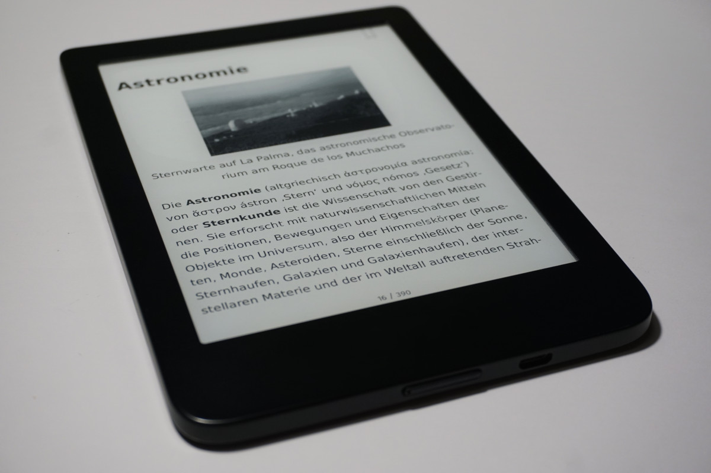

# wiki2book

**wiki2book** is a tool to create beautiful EPUB-eBooks from one or more Wikipedia articles.

The goal is to create eBooks as beautiful as real books from a couple of Wikipedia articles.
This should make reading Wikipedia articles even more fun and may create a whole new readership for this awesome and imperceptibly large database of knowledge. 

<p align="center">

</p>

### Why not simply using pandoc?

Good question.

[Pandoc](https://pandoc.org/epub.html) and others like [wb2pdf](https://mediawiki2latex.wmflabs.org/) or [percollate](https://github.com/danburzo/percollate) as well) are great and yes, they can convert mediawiki to EPUB.
In fact, this converter relies heavily on pandoc because turning HTML into EPUB works perfectly.

However, there are always things missing in these tools, for example rendering math, downloading images, evaluating templates or a proper handling of tables.
They also don't do any eBook specific assumptions, e.g. ignoring ebook-unsuitable styles or not evaluating Wikipedia oriented templates.

Most existing tools are furthermore rather general purpose tools, which is not beneficial for the very specific task of converting Wikipedia articles to beautiful offline eBooks. 

# Usage

## Preliminaries

You need the following tools and fonts:

1. ImageMagick (to have the `convert` command)
2. Pandoc (to have the `pandoc` command). See notes on pandoc versions 2 and 3 below.
3. DejaVu fonts in `/usr/share/fonts/TTF/DejaVuSans*.ttf` (currently hard-coded #15)

## CLI

The current CLI is pretty simple and has three sub-commands:

1. Project: `wiki2book project ./path/to/project.json`
2. Article: `wiki2book article Erde`
3. Standalone: `wiki2book standalone ./path/to/file.mediawiki`

Use `wiki2book -h` for more information and `wiki2book <command> -h` for information on a specific command.

### Project file

When using a project, the mentioned `project.json` is a configuration for a project and may look like this:

```json
{
  "metadata": {
    "title": "My great book",
    "author": "Wikipedia contributors",
    "license": "Creative Commons Non-Commercial Share Alike 3.0",
    "language": "de-DE",
    "date": "2021-12-27"
  },
  "caches": {
    "images": "images",
    "templates": "templates",
    "math": "math",
    "articles": "articles"
  },
  "wikipedia-instance": "de",
  "output-file": "my-book.epub",
  "cover": "cover.png",
  "style": "style.css",
  "pandoc-data-dir": "./pandoc/data",
  "articles": [
    "Hamburg",
    "Hamburger",
    "Pannfisch"
  ]
}
```

The `caches` object is completely optional and in this example the default values are shown.
All values are folders, which don't need to exist, they will be created.

#### Use a different Wikipedia instance

Per default, the english wikipedia is used.
However, you can change the `wikipedia-instance` entry in your projects or config file (s. below; project entries take precedence over configuration entries).
Notice, that you also have to adjust the list of ignore templates and all other language-specific configurations.
Take a look at the [German config file](configs/de.json) and some [German project files](projects/de/) to get an idea of a switch to a different Wikipedia instance.

### Configuration

Next to the project file, the application reads technical, project-independent and basic configurations from a JSON file (e.g. the templates to ignore), which can be specified with `--config / -c`.
See [configs/de.json](configs/de.json) for an example and [src/config/config.go](src/config/config.go) for all technical details on each possible value including their defaults.

Some properties can be configured in both, the project and configuration file (such as the Wikipedia URL).
Entries from the project file are used in case a property is given in both files.

Also take a look at the [config.go](src/config/config.go) source file, which contains a lot of documentation on each config entry.

### Pandoc version 2 and 3

Pandoc version 2 might internally use CSS3 parameters by default, such as the `gap` property.
This might cause problems on certain eBook readers.
To overcome this, pass the argument `--pandoc-data-dir ./pandoc/data` to wiki2book, which uses a template from this repo without such parameter.

Alternatively install pandoc 3, which [avoids CSS3 parameters](https://github.com/jgm/pandoc/blob/3.0/data/epub.css#L166:L169).

### Examples

#### Project

Use the following command to build the German project about astronomy:

`./wiki2book project ./projects/de/astronomie/astronomie.json`

#### Standalone

Or this command to build one file from the integration tests. The `-s` parameter specifies an existing style sheet
file, `-o` the output folder (will be created if it doesn't exist) and the last value specifies the mediawiki file that
should be turned into an eBook.

`./wiki2book standalone -s ./integration-tests/style.css -o ./another-example-book ./integration-tests/test-real-article-Erde.mediawiki`

# Development

For building, running, testing, etc. take a look at the `src` folder and `src/README.md`.

# Long-term goals

* Be independent of the specific Wikipedia instance (#5)
* Create a public API and web app (#7)
* Ask Wikipedia if they want to embed/link to this tool in any way (that would be super cool :D )
